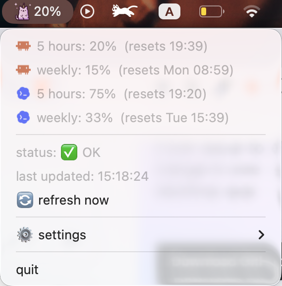

# ClaudeCat - Usage Menu Bar Widget

Native macOS menu bar app for watching Claude and Codex usage in one place.

ClaudeCat reads local OAuth credentials from Claude Code and Codex/ChatGPT, then calls the same usage endpoints those tools rely on. It is a personal utility, not an official Anthropic or OpenAI product.



## Features

- Shows 5-hour usage percentage in the macOS menu bar.
- Dropdown includes Claude and Codex 5-hour and weekly windows.
- Reads credentials from local Keychain/config files; no pasted token required.
- Caches Claude credentials locally to avoid repeated Keychain prompts.
- Refreshes automatically and includes a manual Refresh action.
- Prevents overlapping refreshes and backs off per provider on rate limits.
- Refreshes access tokens when refresh tokens are available.
- Supports animated bundled icons and a user-selected custom icon.

## Requirements

- macOS 12.0 or newer.
- Xcode Command Line Tools: `xcode-select --install`.
- Claude Code must have been logged in on this machine at least once.
- Codex/ChatGPT usage requires local Codex credentials.

The Claude usage endpoint requires the `user:profile` OAuth scope from a normal Claude Code login. A token from `setup-token` is not enough.

## Build

```bash
./scripts/build_app.sh
open ClaudeCat.app
```

The build script creates `ClaudeCat.app` from `ClaudeCatApp/*.swift`, copies bundled assets, ad-hoc signs the app, and can optionally add it to Login Items.

## Release Package

```bash
./scripts/package_release.sh
```

The package script builds the app and writes `dist/ClaudeCat-1.0.1.zip`.

## Structure

```text
ClaudeCatApp/
  *.swift             # native app source split by responsibility
  Info.plist          # app bundle config
assets/               # bundled icons, logos, and README preview
scripts/
  build_app.sh        # interactive local build
  package_release.sh  # non-interactive release zip
tests/                # small Swift logic tests
```

Unused image variants are kept locally under `assets/unused/` and ignored by git.

## Privacy

ClaudeCat reads OAuth credentials from local machine storage and calls Anthropic/OpenAI usage endpoints directly. It does not send data to any other server. Runtime logs/cache stay on your machine under `~/Library/Application Support/ClaudeCat/`.

## Disclaimer

This is a personal utility that uses unofficial endpoints which may change without notice.
